# BUchatbot - Complete Mermaid Diagrams Reference

This document contains all Mermaid diagrams for the BUchatbot project. You can copy and paste these into any Mermaid-compatible editor (mermaid.live, GitHub, etc.) to visualize them.

---

## 1. HIGH-LEVEL SYSTEM ARCHITECTURE

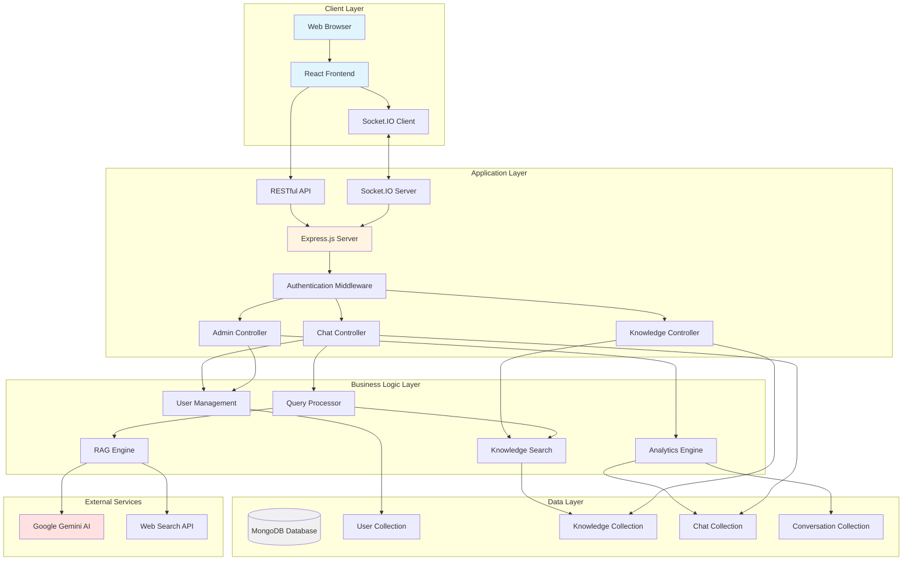
```mermaid
graph TB
    subgraph "Client Layer"
        A[Web Browser]
        B[React Frontend]
        C[Socket.IO Client]
    end
    
    subgraph "Application Layer"
        D[Express.js Server]
        E[RESTful API]
        F[Socket.IO Server]
        G[Authentication Middleware]
        H[Chat Controller]
        I[Admin Controller]
        J[Knowledge Controller]
    end
    
    subgraph "Business Logic Layer"
        K[Query Processor]
        L[Knowledge Search]
        M[RAG Engine]
        N[User Management]
        O[Analytics Engine]
    end
    
    subgraph "Data Layer"
        P[(MongoDB Database)]
        Q[User Collection]
        R[Knowledge Collection]
        S[Chat Collection]
        T[Conversation Collection]
    end
    
    subgraph "External Services"
        U[Google Gemini AI]
        V[Web Search API]
    end
    
    A --> B
    B --> E
    B --> C
    C <--> F
    
    E --> D
    F --> D
    D --> G
    G --> H
    G --> I
    G --> J
    
    H --> K
    H --> N
    I --> N
    I --> O
    J --> L
    
    K --> L
    K --> M
    L --> R
    M --> U
    M --> V
    N --> Q
    O --> S
    O --> T
    
    H --> S
    J --> R
    
    style A fill:#e1f5ff
    style B fill:#e1f5ff
    style D fill:#fff4e1
    style P fill:#f0f0f0
    style U fill:#ffe1e1
```

---

## 2. DETAILED COMPONENT ARCHITECTURE

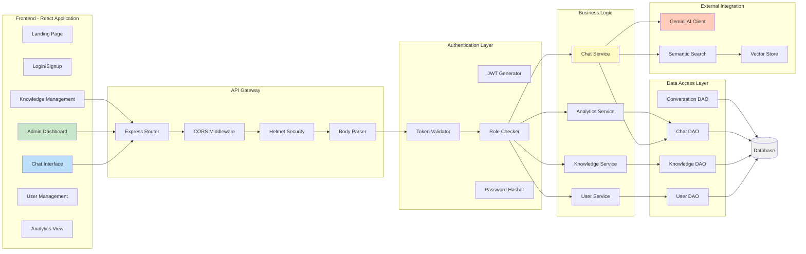
```mermaid
graph LR
    subgraph "Frontend - React Application"
        A1[Landing Page]
        A2[Login/Signup]
        A3[Chat Interface]
        A4[Admin Dashboard]
        A5[Knowledge Management]
        A6[User Management]
        A7[Analytics View]
    end
    
    subgraph "API Gateway"
        B1[Express Router]
        B2[CORS Middleware]
        B3[Helmet Security]
        B4[Body Parser]
    end
    
    subgraph "Authentication Layer"
        C1[JWT Generator]
        C2[Token Validator]
        C3[Role Checker]
        C4[Password Hasher]
    end
    
    subgraph "Business Logic"
        D1[Chat Service]
        D2[Knowledge Service]
        D3[User Service]
        D4[Analytics Service]
    end
    
    subgraph "Data Access Layer"
        E1[User DAO]
        E2[Knowledge DAO]
        E3[Chat DAO]
        E4[Conversation DAO]
    end
    
    subgraph "External Integration"
        F1[Gemini AI Client]
        F2[Vector Store]
        F3[Semantic Search]
    end
    
    A3 --> B1
    A4 --> B1
    A5 --> B1
    B1 --> B2
    B2 --> B3
    B3 --> B4
    B4 --> C2
    C2 --> C3
    
    C3 --> D1
    C3 --> D2
    C3 --> D3
    C3 --> D4
    
    D1 --> E3
    D2 --> E2
    D3 --> E1
    D4 --> E3
    
    D1 --> F1
    D1 --> F3
    F3 --> F2
    
    E1 --> G[(Database)]
    E2 --> G
    E3 --> G
    E4 --> G
    
    style A3 fill:#bbdefb
    style A4 fill:#c8e6c9
    style D1 fill:#fff9c4
    style F1 fill:#ffccbc
    style G fill:#f0f0f0
```

---

## 3. CONTEXT-LEVEL DATA FLOW DIAGRAM (DFD LEVEL 0)

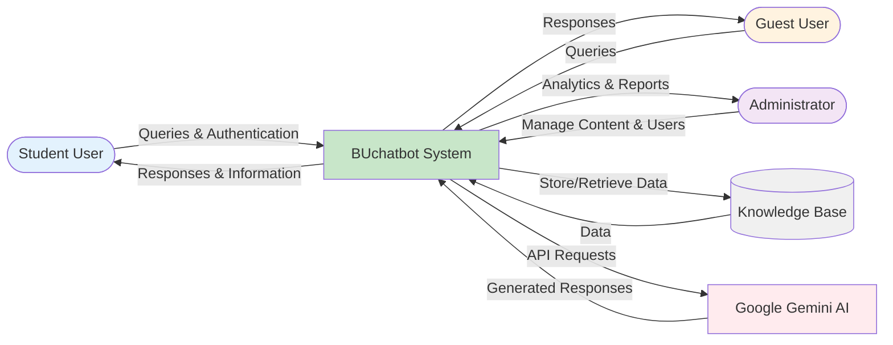
```mermaid
graph LR
    Student([Student User])
    Admin([Administrator])
    Guest([Guest User])
    
    System[BUchatbot System]
    
    DB[(Knowledge Base)]
    AI[Google Gemini AI]
    
    Student -->|Queries & Authentication| System
    System -->|Responses & Information| Student
    
    Guest -->|Queries| System
    System -->|Responses| Guest
    
    Admin -->|Manage Content & Users| System
    System -->|Analytics & Reports| Admin
    
    System -->|Store/Retrieve Data| DB
    DB -->|Data| System
    
    System -->|API Requests| AI
    AI -->|Generated Responses| System
    
    style Student fill:#e3f2fd
    style Admin fill:#f3e5f5
    style Guest fill:#fff3e0
    style System fill:#c8e6c9
    style DB fill:#f0f0f0
    style AI fill:#ffebee
```

---

## 4. LEVEL 1 DATA FLOW DIAGRAM

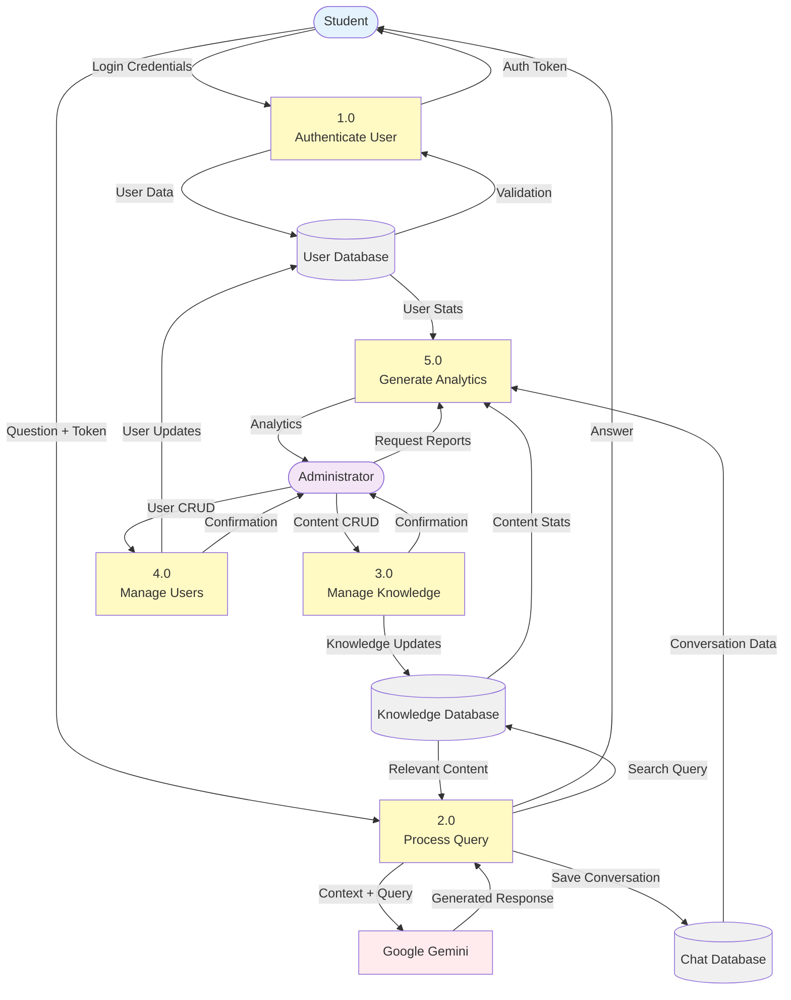
```mermaid
graph TB
    Student([Student])
    Admin([Administrator])
    
    P1[1.0<br/>Authenticate User]
    P2[2.0<br/>Process Query]
    P3[3.0<br/>Manage Knowledge]
    P4[4.0<br/>Manage Users]
    P5[5.0<br/>Generate Analytics]
    
    D1[(User Database)]
    D2[(Knowledge Database)]
    D3[(Chat Database)]
    
    AI[Google Gemini]
    
    Student -->|Login Credentials| P1
    P1 -->|Auth Token| Student
    P1 -->|User Data| D1
    D1 -->|Validation| P1
    
    Student -->|Question + Token| P2
    P2 -->|Answer| Student
    P2 -->|Search Query| D2
    D2 -->|Relevant Content| P2
    P2 -->|Context + Query| AI
    AI -->|Generated Response| P2
    P2 -->|Save Conversation| D3
    
    Admin -->|Content CRUD| P3
    P3 -->|Knowledge Updates| D2
    P3 -->|Confirmation| Admin
    
    Admin -->|User CRUD| P4
    P4 -->|User Updates| D1
    P4 -->|Confirmation| Admin
    
    Admin -->|Request Reports| P5
    P5 -->|Analytics| Admin
    D3 -->|Conversation Data| P5
    D1 -->|User Stats| P5
    D2 -->|Content Stats| P5
    
    style Student fill:#e3f2fd
    style Admin fill:#f3e5f5
    style P1 fill:#fff9c4
    style P2 fill:#fff9c4
    style P3 fill:#fff9c4
    style P4 fill:#fff9c4
    style P5 fill:#fff9c4
    style D1 fill:#f0f0f0
    style D2 fill:#f0f0f0
    style D3 fill:#f0f0f0
    style AI fill:#ffebee
```

---

## 5. LEVEL 2 DFD - QUERY PROCESSING DETAIL

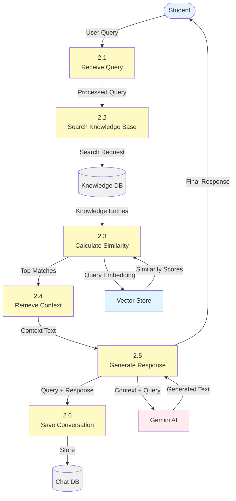
```mermaid
graph TB
    Student([Student])
    
    P2.1[2.1<br/>Receive Query]
    P2.2[2.2<br/>Search Knowledge Base]
    P2.3[2.3<br/>Calculate Similarity]
    P2.4[2.4<br/>Retrieve Context]
    P2.5[2.5<br/>Generate Response]
    P2.6[2.6<br/>Save Conversation]
    
    D2[(Knowledge DB)]
    D3[(Chat DB)]
    AI[Gemini AI]
    VS[Vector Store]
    
    Student -->|User Query| P2.1
    P2.1 -->|Processed Query| P2.2
    P2.2 -->|Search Request| D2
    D2 -->|Knowledge Entries| P2.3
    P2.3 -->|Query Embedding| VS
    VS -->|Similarity Scores| P2.3
    P2.3 -->|Top Matches| P2.4
    P2.4 -->|Context Text| P2.5
    P2.5 -->|Context + Query| AI
    AI -->|Generated Text| P2.5
    P2.5 -->|Final Response| Student
    P2.5 -->|Query + Response| P2.6
    P2.6 -->|Store| D3
    
    style Student fill:#e3f2fd
    style P2.1 fill:#fff9c4
    style P2.2 fill:#fff9c4
    style P2.3 fill:#fff9c4
    style P2.4 fill:#fff9c4
    style P2.5 fill:#fff9c4
    style P2.6 fill:#fff9c4
    style D2 fill:#f0f0f0
    style D3 fill:#f0f0f0
    style AI fill:#ffebee
    style VS fill:#e1f5fe
```

---

## 6. STUDENT USER USE CASE DIAGRAM

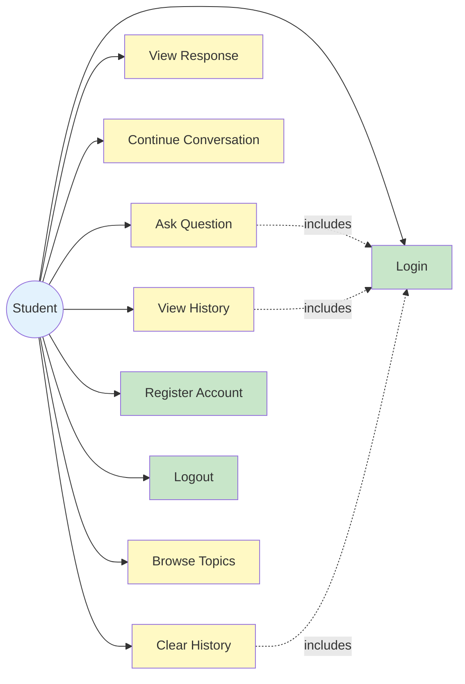
```mermaid
graph LR
    Student((Student))
    
    UC1[Ask Question]
    UC2[View Response]
    UC3[Continue Conversation]
    UC4[View History]
    UC5[Clear History]
    UC6[Register Account]
    UC7[Login]
    UC8[Logout]
    UC9[Browse Topics]
    
    Student --> UC1
    Student --> UC2
    Student --> UC3
    Student --> UC4
    Student --> UC5
    Student --> UC6
    Student --> UC7
    Student --> UC8
    Student --> UC9
    
    UC1 -.->|includes| UC7
    UC4 -.->|includes| UC7
    UC5 -.->|includes| UC7
    
    style Student fill:#e3f2fd
    style UC1 fill:#fff9c4
    style UC2 fill:#fff9c4
    style UC3 fill:#fff9c4
    style UC4 fill:#fff9c4
    style UC5 fill:#fff9c4
    style UC6 fill:#c8e6c9
    style UC7 fill:#c8e6c9
    style UC8 fill:#c8e6c9
    style UC9 fill:#fff9c4
```

---

## 7. ADMINISTRATOR USE CASE DIAGRAM


```mermaid
graph TB
    Admin((Administrator))
    
    UC10[Manage Knowledge Base]
    UC11[Add Knowledge Entry]
    UC12[Edit Knowledge Entry]
    UC13[Delete Knowledge Entry]
    
    UC14[Manage FAQs]
    UC15[Add FAQ]
    UC16[Edit FAQ]
    UC17[Delete FAQ]
    
    UC18[Manage Users]
    UC19[View Users]
    UC20[Create User]
    UC21[Edit User]
    UC22[Delete User]
    
    UC23[View Conversations]
    UC24[View Conversation Detail]
    UC25[Delete Conversation]
    
    UC26[View Analytics]
    UC27[Generate Reports]
    
    UC28[Login as Admin]
    
    Admin --> UC10
    Admin --> UC14
    Admin --> UC18
    Admin --> UC23
    Admin --> UC26
    Admin --> UC28
    
    UC10 --> UC11
    UC10 --> UC12
    UC10 --> UC13
    
    UC14 --> UC15
    UC14 --> UC16
    UC14 --> UC17
    
    UC18 --> UC19
    UC18 --> UC20
    UC18 --> UC21
    UC18 --> UC22
    
    UC23 --> UC24
    UC23 --> UC25
    
    UC26 --> UC27
    
    UC10 -.->|requires| UC28
    UC14 -.->|requires| UC28
    UC18 -.->|requires| UC28
    UC23 -.->|requires| UC28
    UC26 -.->|requires| UC28
    
    style Admin fill:#f3e5f5
    style UC10 fill:#fff9c4
    style UC14 fill:#fff9c4
    style UC18 fill:#fff9c4
    style UC23 fill:#fff9c4
    style UC26 fill:#fff9c4
    style UC28 fill:#ffccbc
```

---

## 8. USER REGISTRATION SEQUENCE DIAGRAM

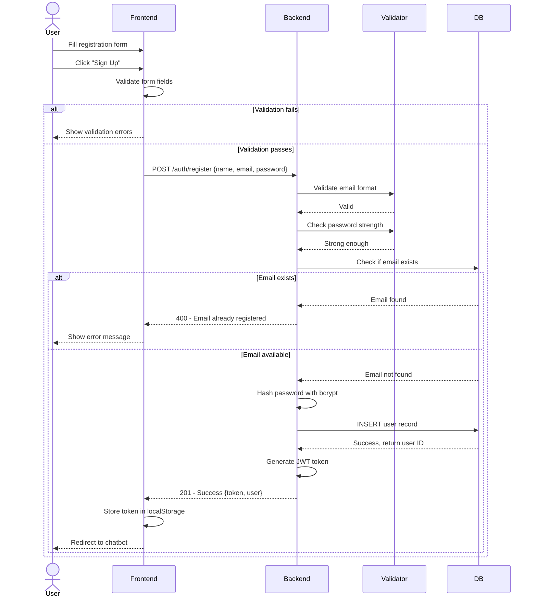
```mermaid
sequenceDiagram
    actor User
    participant Frontend
    participant Backend
    participant Validator
    participant DB
    
    User->>Frontend: Fill registration form
    User->>Frontend: Click "Sign Up"
    Frontend->>Frontend: Validate form fields
    
    alt Validation fails
        Frontend-->>User: Show validation errors
    else Validation passes
        Frontend->>Backend: POST /auth/register {name, email, password}
        Backend->>Validator: Validate email format
        Validator-->>Backend: Valid
        Backend->>Validator: Check password strength
        Validator-->>Backend: Strong enough
        Backend->>DB: Check if email exists
        
        alt Email exists
            DB-->>Backend: Email found
            Backend-->>Frontend: 400 - Email already registered
            Frontend-->>User: Show error message
        else Email available
            DB-->>Backend: Email not found
            Backend->>Backend: Hash password with bcrypt
            Backend->>DB: INSERT user record
            DB-->>Backend: Success, return user ID
            Backend->>Backend: Generate JWT token
            Backend-->>Frontend: 201 - Success {token, user}
            Frontend->>Frontend: Store token in localStorage
            Frontend-->>User: Redirect to chatbot
        end
    end
```

---

## 9. USER LOGIN SEQUENCE DIAGRAM

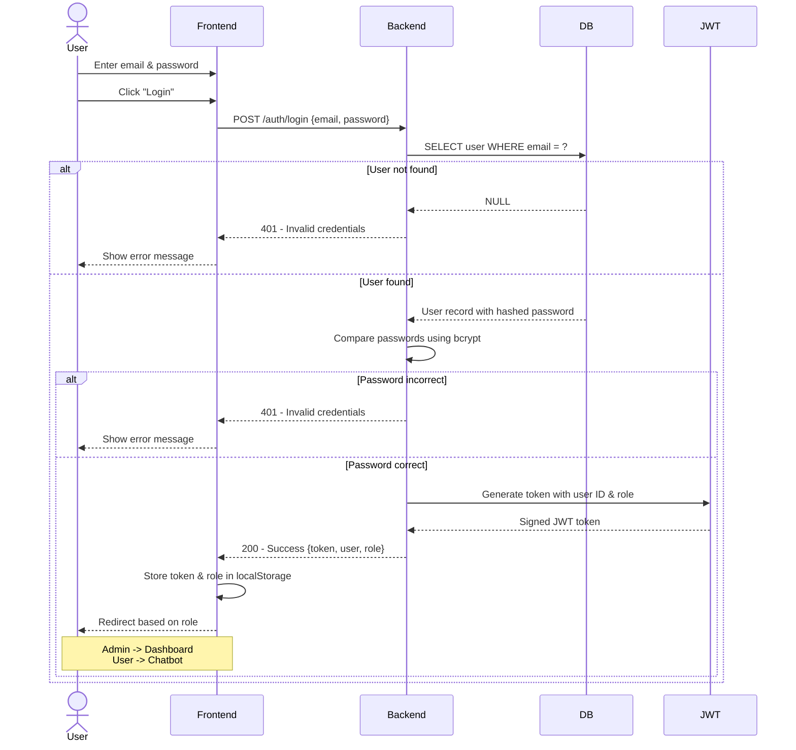
```mermaid
sequenceDiagram
    actor User
    participant Frontend
    participant Backend
    participant DB
    participant JWT
    
    User->>Frontend: Enter email & password
    User->>Frontend: Click "Login"
    Frontend->>Backend: POST /auth/login {email, password}
    Backend->>DB: SELECT user WHERE email = ?
    
    alt User not found
        DB-->>Backend: NULL
        Backend-->>Frontend: 401 - Invalid credentials
        Frontend-->>User: Show error message
    else User found
        DB-->>Backend: User record with hashed password
        Backend->>Backend: Compare passwords using bcrypt
        
        alt Password incorrect
            Backend-->>Frontend: 401 - Invalid credentials
            Frontend-->>User: Show error message
        else Password correct
            Backend->>JWT: Generate token with user ID & role
            JWT-->>Backend: Signed JWT token
            Backend-->>Frontend: 200 - Success {token, user, role}
            Frontend->>Frontend: Store token & role in localStorage
            Frontend-->>User: Redirect based on role
            Note over Frontend,User: Admin -> Dashboard<br/>User -> Chatbot
        end
    end
```

---

## 10. QUERY PROCESSING WITH RAG SEQUENCE DIAGRAM

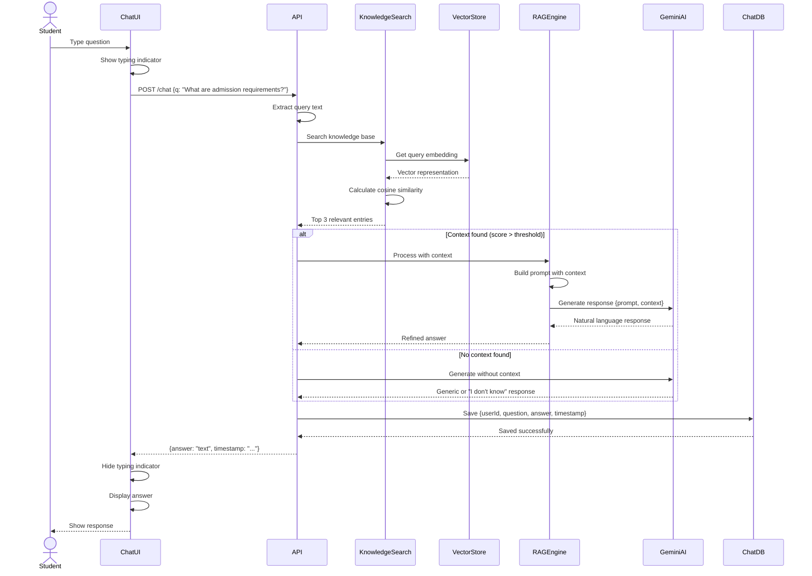
```mermaid
sequenceDiagram
    actor Student
    participant ChatUI
    participant API
    participant KnowledgeSearch
    participant VectorStore
    participant RAGEngine
    participant GeminiAI
    participant ChatDB
    
    Student->>ChatUI: Type question
    ChatUI->>ChatUI: Show typing indicator
    ChatUI->>API: POST /chat {q: "What are admission requirements?"}
    API->>API: Extract query text
    
    API->>KnowledgeSearch: Search knowledge base
    KnowledgeSearch->>VectorStore: Get query embedding
    VectorStore-->>KnowledgeSearch: Vector representation
    KnowledgeSearch->>KnowledgeSearch: Calculate cosine similarity
    KnowledgeSearch-->>API: Top 3 relevant entries
    
    alt Context found (score > threshold)
        API->>RAGEngine: Process with context
        RAGEngine->>RAGEngine: Build prompt with context
        RAGEngine->>GeminiAI: Generate response {prompt, context}
        GeminiAI-->>RAGEngine: Natural language response
        RAGEngine-->>API: Refined answer
    else No context found
        API->>GeminiAI: Generate without context
        GeminiAI-->>API: Generic or "I don't know" response
    end
    
    API->>ChatDB: Save {userId, question, answer, timestamp}
    ChatDB-->>API: Saved successfully
    API-->>ChatUI: {answer: "text", timestamp: "..."}
    ChatUI->>ChatUI: Hide typing indicator
    ChatUI->>ChatUI: Display answer
    ChatUI-->>Student: Show response
```

---

## 11. ADMIN KNOWLEDGE MANAGEMENT SEQUENCE DIAGRAM

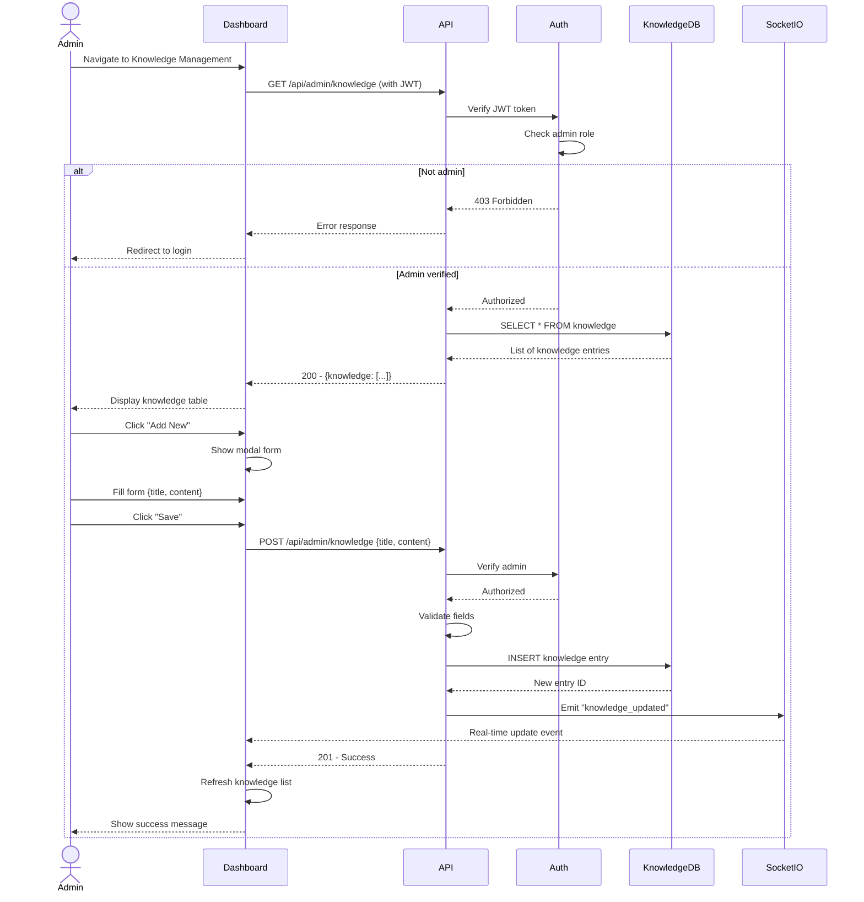
```mermaid
sequenceDiagram
    actor Admin
    participant Dashboard
    participant API
    participant Auth
    participant KnowledgeDB
    participant SocketIO
    
    Admin->>Dashboard: Navigate to Knowledge Management
    Dashboard->>API: GET /api/admin/knowledge (with JWT)
    API->>Auth: Verify JWT token
    Auth->>Auth: Check admin role
    
    alt Not admin
        Auth-->>API: 403 Forbidden
        API-->>Dashboard: Error response
        Dashboard-->>Admin: Redirect to login
    else Admin verified
        Auth-->>API: Authorized
        API->>KnowledgeDB: SELECT * FROM knowledge
        KnowledgeDB-->>API: List of knowledge entries
        API-->>Dashboard: 200 - {knowledge: [...]}
        Dashboard-->>Admin: Display knowledge table
        
        Admin->>Dashboard: Click "Add New"
        Dashboard->>Dashboard: Show modal form
        Admin->>Dashboard: Fill form {title, content}
        Admin->>Dashboard: Click "Save"
        
        Dashboard->>API: POST /api/admin/knowledge {title, content}
        API->>Auth: Verify admin
        Auth-->>API: Authorized
        API->>API: Validate fields
        API->>KnowledgeDB: INSERT knowledge entry
        KnowledgeDB-->>API: New entry ID
        API->>SocketIO: Emit "knowledge_updated"
        SocketIO-->>Dashboard: Real-time update event
        API-->>Dashboard: 201 - Success
        Dashboard->>Dashboard: Refresh knowledge list
        Dashboard-->>Admin: Show success message
    end
```

---

## 12. REAL-TIME CONVERSATION NOTIFICATION SEQUENCE DIAGRAM

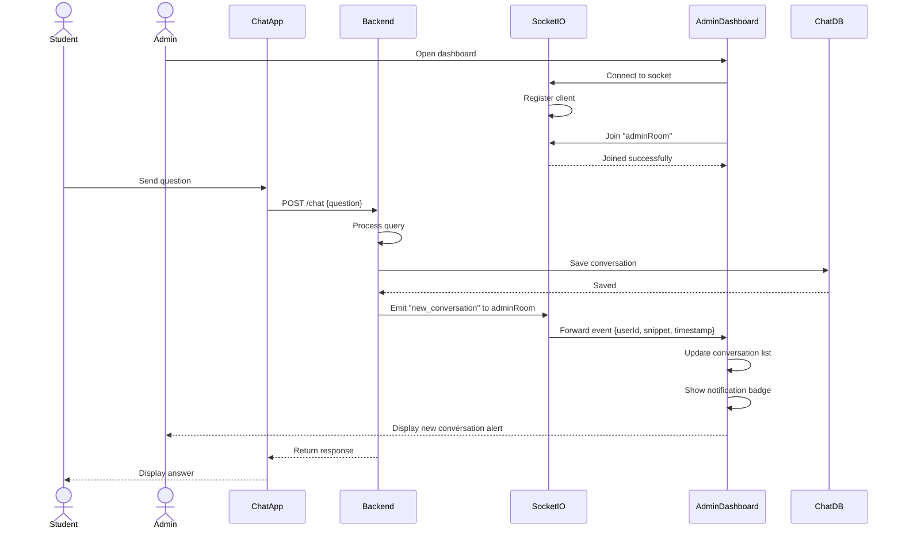
```mermaid
sequenceDiagram
    actor Student
    actor Admin
    participant ChatApp
    participant Backend
    participant SocketIO
    participant AdminDashboard
    participant ChatDB
    
    Admin->>AdminDashboard: Open dashboard
    AdminDashboard->>SocketIO: Connect to socket
    SocketIO->>SocketIO: Register client
    AdminDashboard->>SocketIO: Join "adminRoom"
    SocketIO-->>AdminDashboard: Joined successfully
    
    Student->>ChatApp: Send question
    ChatApp->>Backend: POST /chat {question}
    Backend->>Backend: Process query
    Backend->>ChatDB: Save conversation
    ChatDB-->>Backend: Saved
    
    Backend->>SocketIO: Emit "new_conversation" to adminRoom
    SocketIO->>AdminDashboard: Forward event {userId, snippet, timestamp}
    AdminDashboard->>AdminDashboard: Update conversation list
    AdminDashboard->>AdminDashboard: Show notification badge
    AdminDashboard-->>Admin: Display new conversation alert
    
    Backend-->>ChatApp: Return response
    ChatApp-->>Student: Display answer
```

---

## 13. COMPONENT DIAGRAM

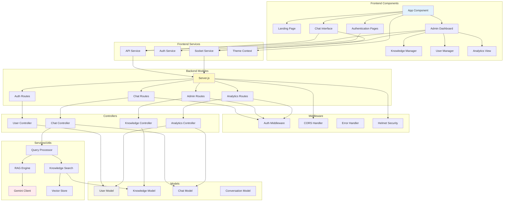
```mermaid
graph TB
    subgraph "Frontend Components"
        FC1[App Component]
        FC2[Landing Page]
        FC3[Chat Interface]
        FC4[Admin Dashboard]
        FC5[Authentication Pages]
        FC6[Knowledge Manager]
        FC7[User Manager]
        FC8[Analytics View]
    end
    
    subgraph "Frontend Services"
        FS1[API Service]
        FS2[Auth Service]
        FS3[Socket Service]
        FS4[Theme Context]
    end
    
    subgraph "Backend Modules"
        BM1[Server.js]
        BM2[Chat Routes]
        BM3[Auth Routes]
        BM4[Admin Routes]
        BM5[Analytics Routes]
    end
    
    subgraph "Middleware"
        MW1[Auth Middleware]
        MW2[CORS Handler]
        MW3[Error Handler]
        MW4[Helmet Security]
    end
    
    subgraph "Controllers"
        CT1[Chat Controller]
        CT2[User Controller]
        CT3[Knowledge Controller]
        CT4[Analytics Controller]
    end
    
    subgraph "Services/Utils"
        SV1[Query Processor]
        SV2[Knowledge Search]
        SV3[RAG Engine]
        SV4[Gemini Client]
        SV5[Vector Store]
    end
    
    subgraph "Models"
        MD1[User Model]
        MD2[Knowledge Model]
        MD3[Chat Model]
        MD4[Conversation Model]
    end
    
    FC1 --> FC2
    FC1 --> FC3
    FC1 --> FC4
    FC1 --> FC5
    FC4 --> FC6
    FC4 --> FC7
    FC4 --> FC8
    
    FC3 --> FS1
    FC4 --> FS1
    FC3 --> FS3
    FC4 --> FS3
    FC5 --> FS2
    FC1 --> FS4
    
    FS1 --> BM1
    FS3 --> BM1
    
    BM1 --> MW2
    BM1 --> MW4
    BM1 --> BM2
    BM1 --> BM3
    BM1 --> BM4
    BM1 --> BM5
    
    BM2 --> MW1
    BM4 --> MW1
    BM5 --> MW1
    
    BM2 --> CT1
    BM3 --> CT2
    BM4 --> CT3
    BM5 --> CT4
    
    CT1 --> SV1
    CT1 --> MD3
    CT2 --> MD1
    CT3 --> MD2
    CT4 --> MD3
    CT4 --> MD1
    
    SV1 --> SV2
    SV1 --> SV3
    SV2 --> SV5
    SV2 --> MD2
    SV3 --> SV4
    
    style FC1 fill:#e3f2fd
    style BM1 fill:#fff9c4
    style MD1 fill:#f0f0f0
    style SV4 fill:#ffebee
```

---

## 14. CLASS DIAGRAM (DOMAIN MODEL)

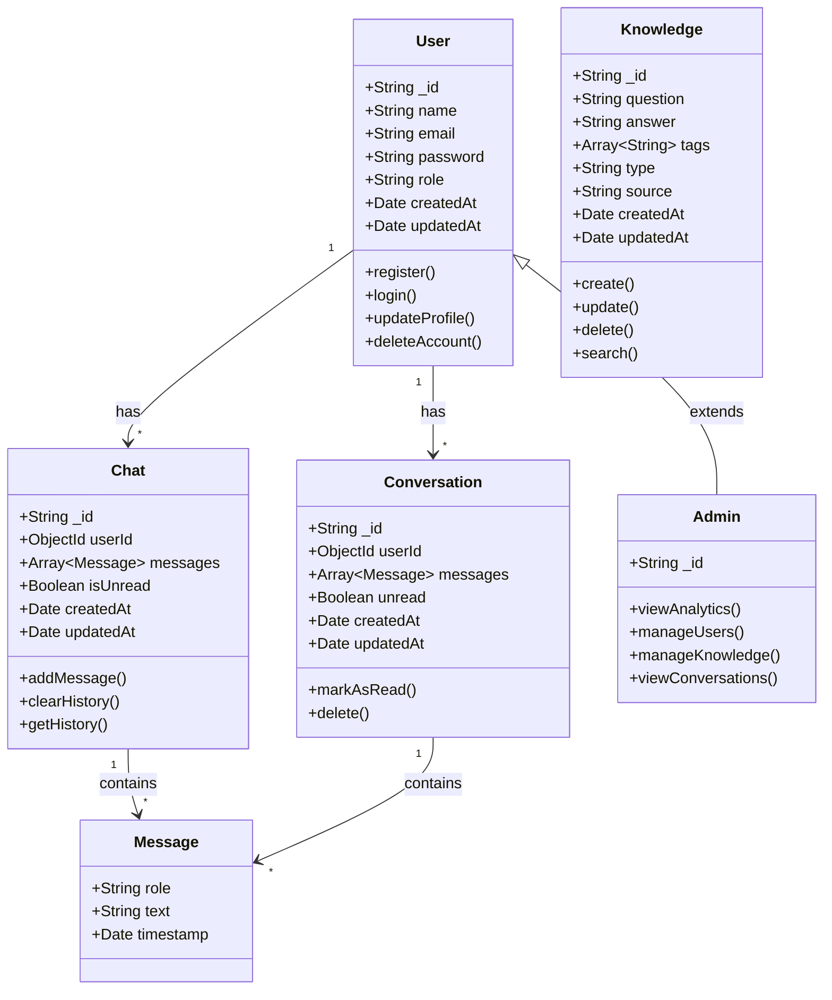
```mermaid
classDiagram
    class User {
        +String _id
        +String name
        +String email
        +String password
        +String role
        +Date createdAt
        +Date updatedAt
        +register()
        +login()
        +updateProfile()
        +deleteAccount()
    }
    
    class Knowledge {
        +String _id
        +String question
        +String answer
        +Array~String~ tags
        +String type
        +String source
        +Date createdAt
        +Date updatedAt
        +create()
        +update()
        +delete()
        +search()
    }
    
    class Chat {
        +String _id
        +ObjectId userId
        +Array~Message~ messages
        +Boolean isUnread
        +Date createdAt
        +Date updatedAt
        +addMessage()
        +clearHistory()
        +getHistory()
    }
    
    class Message {
        +String role
        +String text
        +Date timestamp
    }
    
    class Conversation {
        +String _id
        +ObjectId userId
        +Array~Message~ messages
        +Boolean unread
        +Date createdAt
        +Date updatedAt
        +markAsRead()
        +delete()
    }
    
    class Admin {
        +String _id
        +viewAnalytics()
        +manageUsers()
        +manageKnowledge()
        +viewConversations()
    }
    
    User "1" --> "*" Chat : has
    User "1" --> "*" Conversation : has
    Chat "1" --> "*" Message : contains
    Conversation "1" --> "*" Message : contains
    User <|-- Admin : extends
```

---

## 15. ENTITY RELATIONSHIP DIAGRAM (ERD)

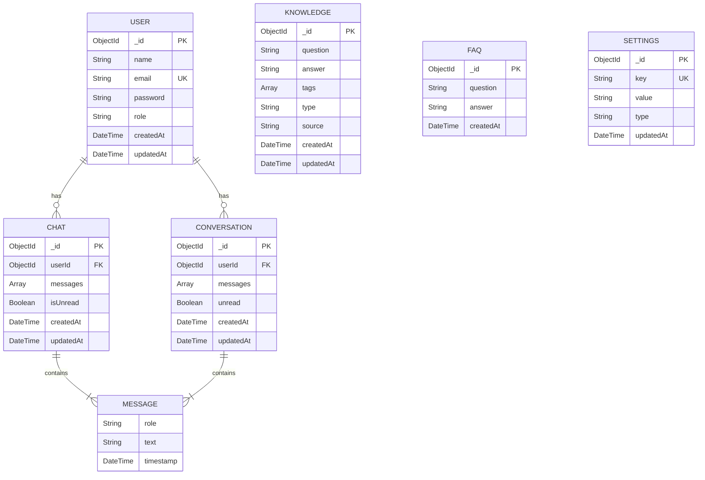
```mermaid
erDiagram
    USER ||--o{ CHAT : has
    USER ||--o{ CONVERSATION : has
    CHAT ||--|{ MESSAGE : contains
    CONVERSATION ||--|{ MESSAGE : contains
    
    USER {
        ObjectId _id PK
        String name
        String email UK
        String password
        String role
        DateTime createdAt
        DateTime updatedAt
    }
    
    KNOWLEDGE {
        ObjectId _id PK
        String question
        String answer
        Array tags
        String type
        String source
        DateTime createdAt
        DateTime updatedAt
    }
    
    CHAT {
        ObjectId _id PK
        ObjectId userId FK
        Array messages
        Boolean isUnread
        DateTime createdAt
        DateTime updatedAt
    }
    
    CONVERSATION {
        ObjectId _id PK
        ObjectId userId FK
        Array messages
        Boolean unread
        DateTime createdAt
        DateTime updatedAt
    }
    
    MESSAGE {
        String role
        String text
        DateTime timestamp
    }
    
    FAQ {
        ObjectId _id PK
        String question
        String answer
        DateTime createdAt
    }
    
    SETTINGS {
        ObjectId _id PK
        String key UK
        String value
        String type
        DateTime updatedAt
    }
```

---

## 16. DATABASE SCHEMA OVERVIEW

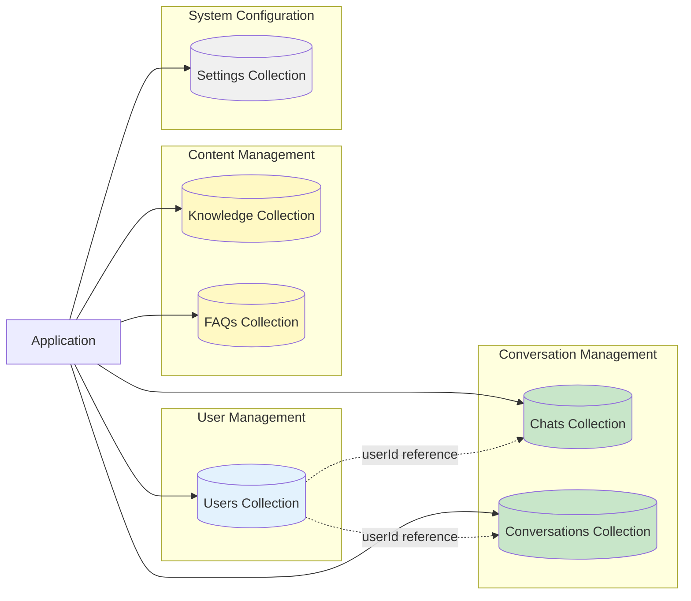
```mermaid
graph LR
    subgraph "User Management"
        U1[(Users Collection)]
    end
    
    subgraph "Content Management"
        C1[(Knowledge Collection)]
        C2[(FAQs Collection)]
    end
    
    subgraph "Conversation Management"
        V1[(Chats Collection)]
        V2[(Conversations Collection)]
    end
    
    subgraph "System Configuration"
        S1[(Settings Collection)]
    end
    
    APP[Application]
    
    APP --> U1
    APP --> C1
    APP --> C2
    APP --> V1
    APP --> V2
    APP --> S1
    
    U1 -.->|userId reference| V1
    U1 -.->|userId reference| V2
    
    style U1 fill:#e3f2fd
    style C1 fill:#fff9c4
    style C2 fill:#fff9c4
    style V1 fill:#c8e6c9
    style V2 fill:#c8e6c9
    style S1 fill:#f0f0f0
```

---

## 17. DEPLOYMENT DIAGRAM

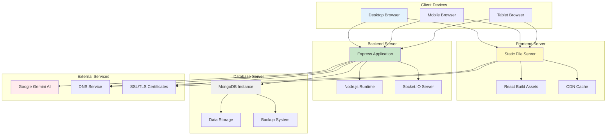
```mermaid
graph TB
    subgraph "Client Devices"
        CD1[Desktop Browser]
        CD2[Mobile Browser]
        CD3[Tablet Browser]
    end
    
    subgraph "Frontend Server"
        FS1[Static File Server]
        FS2[React Build Assets]
        FS3[CDN Cache]
    end
    
    subgraph "Backend Server"
        BS1[Node.js Runtime]
        BS2[Express Application]
        BS3[Socket.IO Server]
    end
    
    subgraph "Database Server"
        DS1[MongoDB Instance]
        DS2[Data Storage]
        DS3[Backup System]
    end
    
    subgraph "External Services"
        ES1[Google Gemini AI]
        ES2[DNS Service]
        ES3[SSL/TLS Certificates]
    end
    
    CD1 --> FS1
    CD2 --> FS1
    CD3 --> FS1
    
    FS1 --> FS2
    FS1 --> FS3
    
    CD1 --> BS2
    CD2 --> BS2
    CD3 --> BS2
    
    BS2 --> BS1
    BS2 --> BS3
    
    BS2 --> DS1
    DS1 --> DS2
    DS1 --> DS3
    
    BS2 --> ES1
    
    FS1 --> ES2
    BS2 --> ES2
    
    FS1 --> ES3
    BS2 --> ES3
    
    style CD1 fill:#e3f2fd
    style FS1 fill:#fff9c4
    style BS2 fill:#c8e6c9
    style DS1 fill:#f0f0f0
    style ES1 fill:#ffebee
```

---

## 18. AGILE DEVELOPMENT WORKFLOW

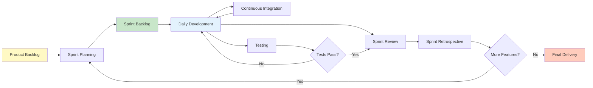
```mermaid
graph LR
    A[Product Backlog] --> B[Sprint Planning]
    B --> C[Sprint Backlog]
    C --> D[Daily Development]
    D --> E[Sprint Review]
    E --> F[Sprint Retrospective]
    F --> G{More Features?}
    G -->|Yes| B
    G -->|No| H[Final Delivery]
    
    D --> I[Continuous Integration]
    I --> D
    
    D --> J[Testing]
    J --> K{Tests Pass?}
    K -->|No| D
    K -->|Yes| E
    
    style A fill:#fff9c4
    style C fill:#c8e6c9
    style D fill:#e3f2fd
    style H fill:#ffccbc
```

---

## 19. RAG (RETRIEVAL-AUGMENTED GENERATION) FLOW

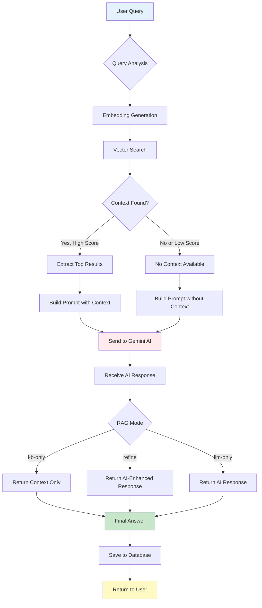
```mermaid
graph TD
    A[User Query] --> B{Query Analysis}
    B --> C[Embedding Generation]
    C --> D[Vector Search]
    D --> E{Context Found?}
    
    E -->|Yes, High Score| F[Extract Top Results]
    E -->|No or Low Score| G[No Context Available]
    
    F --> H[Build Prompt with Context]
    G --> I[Build Prompt without Context]
    
    H --> J[Send to Gemini AI]
    I --> J
    
    J --> K[Receive AI Response]
    
    K --> L{RAG Mode}
    
    L -->|kb-only| M[Return Context Only]
    L -->|refine| N[Return AI-Enhanced Response]
    L -->|llm-only| O[Return AI Response]
    
    M --> P[Final Answer]
    N --> P
    O --> P
    
    P --> Q[Save to Database]
    Q --> R[Return to User]
    
    style A fill:#e3f2fd
    style J fill:#ffebee
    style P fill:#c8e6c9
    style R fill:#fff9c4
```

---

## 20. SYSTEM TESTING WORKFLOW

```mermaid
graph TB
    A[Unit Tests] --> B{All Pass?}
    B -->|No| C[Fix Issues]
    C --> A
    B -->|Yes| D[Integration Tests]
    
    D --> E{All Pass?}
    E -->|No| F[Fix Integration Issues]
    F --> D
    E -->|Yes| G[System Tests]
    
    G --> H{All Pass?}
    H -->|No| I[Fix System Issues]
    I --> G
    H -->|Yes| J[Performance Tests]
    
    J --> K{Meets Requirements?}
    K -->|No| L[Optimize Performance]
    L --> J
    K -->|Yes| M[Security Tests]
    
    M --> N{Secure?}
    N -->|No| O[Fix Vulnerabilities]
    O --> M
    N -->|Yes| P[User Acceptance Tests]
    
    
