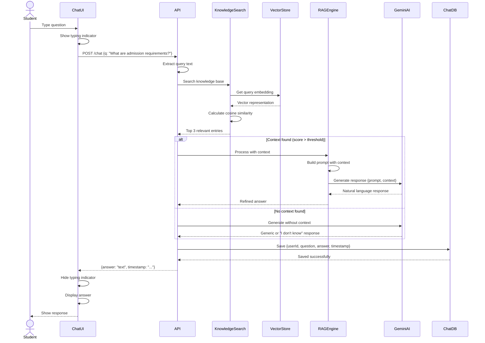
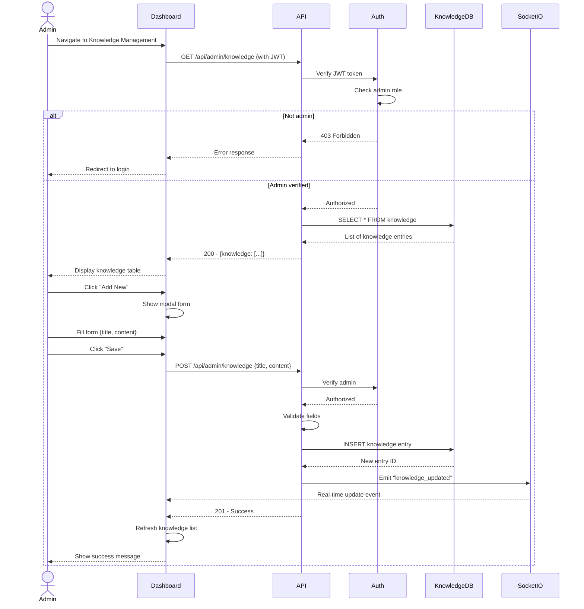
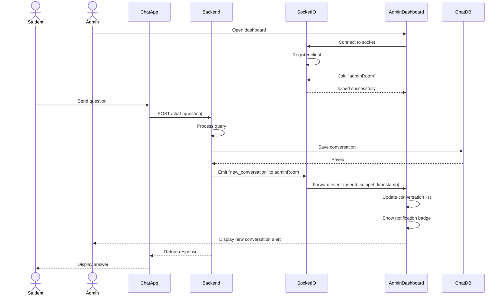
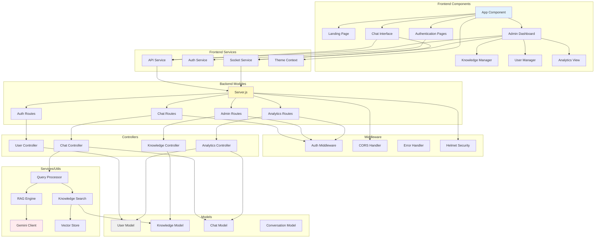
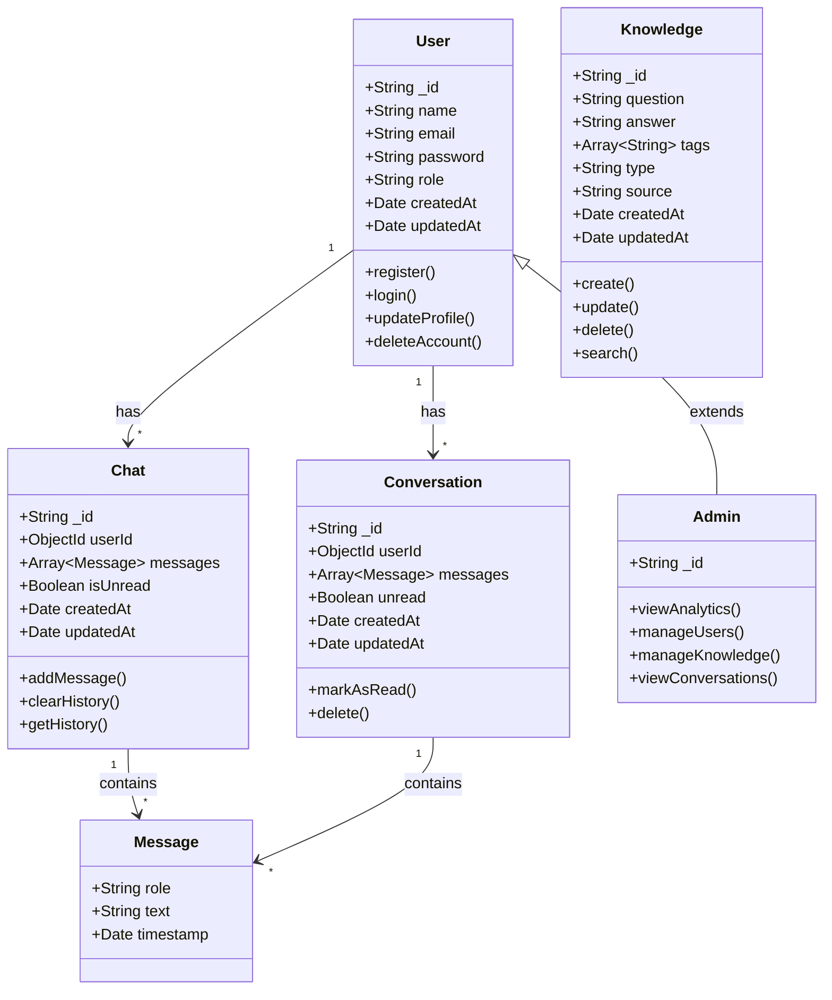
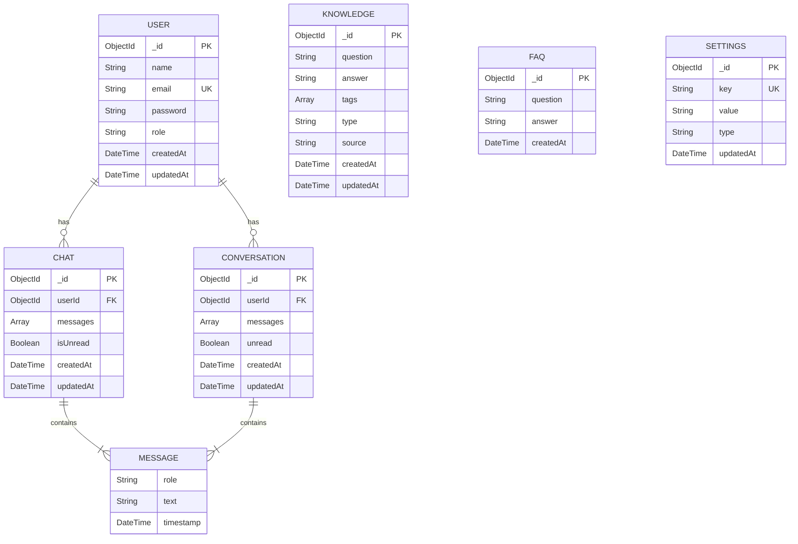
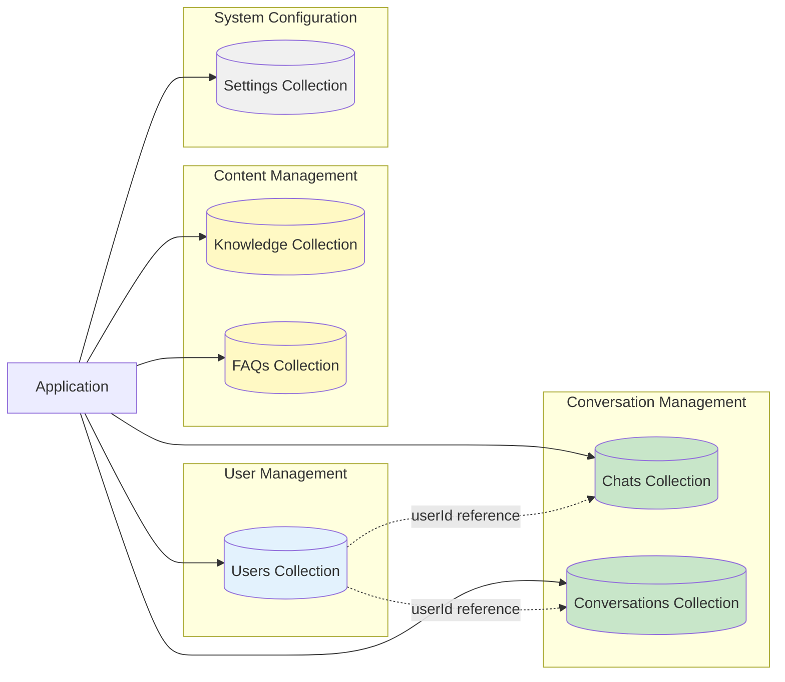

## 4.4.4 Sequence Diagrams (Continued)

#### Query Processing with RAG Sequence



#### Admin Knowledge Management Sequence



#### Real-Time Conversation Notification Sequence



### 4.4.5 Component Diagram

Component diagrams show the organization and dependencies among software components.



### 4.4.6 Class Diagram (Domain Model)



## 4.5 Database Design

The BUchatbot system uses MongoDB, a NoSQL document-oriented database, for data persistence. MongoDB was chosen for its flexibility in schema design, scalability, and excellent support for JavaScript/Node.js through Mongoose ODM.

### 4.5.1 Entity Relationship Diagram (ERD)

The following ERD represents the logical data model showing entities, attributes, and relationships.



### 4.5.2 Database Schema Overview



### 4.5.3 Table Structures (MongoDB Collections)

#### User Collection

```javascript
{
  _id: ObjectId,
  name: String (required),
  email: String (required, unique, lowercase),
  password: String (hashed with bcrypt),
  role: String (enum: ["user", "admin", "editor", "viewer"], default: "user"),
  createdAt: DateTime (auto-generated),
  updatedAt: DateTime (auto-generated)
}
```

**Indexes:**
- Primary: `_id` (auto-created)
- Unique: `email`
- Index on `role` for admin queries

**Sample Document:**
```json
{
  "_id": "65a1b2c3d4e5f6789012345",
  "name": "John Mukasa",
  "email": "john.mukasa@student.bu.ac.ug",
  "password": "$2b$10$abcdefghijklmnopqrstuvwxyz1234567890",
  "role": "user",
  "createdAt": "2024-01-15T10:30:00.000Z",
  "updatedAt": "2024-01-15T10:30:00.000Z"
}
```

#### Knowledge Collection

```javascript
{
  _id: ObjectId,
  question: String (required, indexed),
  answer: String (required),
  tags: [String] (optional),
  type: String (enum: ["knowledge", "faq"], default: "knowledge"),
  source: String (default: "Admin Panel"),
  createdAt: DateTime (auto-generated),
  updatedAt: DateTime (auto-generated)
}
```

**Indexes:**
- Primary: `_id`
- Text index on `question` and `answer` for search
- Index on `type` for filtering
- Index on `tags` for category queries

**Sample Document:**
```json
{
  "_id": "65a1b2c3d4e5f6789012346",
  "question": "What are the admission requirements for undergraduate programs?",
  "answer": "To be admitted to Bugema University undergraduate programs, applicants must have: 1) Uganda Certificate of Education (UCE) with at least 5 passes, 2) Uganda Advanced Certificate of Education (UACE) with at least 2 principal passes, 3) Completed application form with required documents, 4) Application fee payment. Some programs may have additional requirements.",
  "tags": ["admissions", "undergraduate", "requirements"],
  "type": "knowledge",
  "source": "Admin Panel",
  "createdAt": "2024-01-10T08:00:00.000Z",
  "updatedAt": "2024-01-10T08:00:00.000Z"
}
```

#### Chat Collection

```javascript
{
  _id: ObjectId,
  userId: ObjectId (reference to User, optional for guests),
  messages: [
    {
      role: String (enum: ["user", "assistant"]),
      text: String,
      timestamp: DateTime (default: now)
    }
  ],
  isUnread: Boolean (default: false),
  createdAt: DateTime (auto-generated),
  updatedAt: DateTime (auto-generated)
}
```

**Indexes:**
- Primary: `_id`
- Index on `userId` for user-specific queries
- Index on `updatedAt` for recent conversations
- Index on `isUnread` for admin notifications

**Sample Document:**
```json
{
  "_id": "65a1b2c3d4e5f6789012347",
  "userId": "65a1b2c3d4e5f6789012345",
  "messages": [
    {
      "role": "user",
      "text": "What are the tuition fees for Bachelor of Computer Science?",
      "timestamp": "2024-01-15T14:20:00.000Z"
    },
    {
      "role": "assistant",
      "text": "The tuition fees for Bachelor of Computer Science at Bugema University are UGX 2,500,000 per semester for Ugandan students and USD 1,500 per semester for international students. This covers tuition only and does not include accommodation, meals, or other fees.",
      "timestamp": "2024-01-15T14:20:02.000Z"
    },
    {
      "role": "user",
      "text": "What other fees should I expect?",
      "timestamp": "2024-01-15T14:21:00.000Z"
    },
    {
      "role": "assistant",
      "text": "In addition to tuition, students should budget for: 1) Registration fee: UGX 150,000 per semester, 2) ID card: UGX 20,000 (one-time), 3) Medical examination: UGX 50,000, 4) Caution money: UGX 100,000 (refundable), 5) Library fees: UGX 30,000 per semester. Accommodation and meals are additional if you choose to stay on campus.",
      "timestamp": "2024-01-15T14:21:03.000Z"
    }
  ],
  "isUnread": true,
  "createdAt": "2024-01-15T14:20:00.000Z",
  "updatedAt": "2024-01-15T14:21:03.000Z"
}
```

#### Conversation Collection

```javascript
{
  _id: ObjectId,
  userId: ObjectId (reference to User),
  messages: [
    {
      sender: String,
      text: String,
      timestamp: DateTime (default: now)
    }
  ],
  unread: Boolean (default: false),
  createdAt: DateTime (auto-generated),
  updatedAt: DateTime (auto-generated)
}
```

**Indexes:**
- Primary: `_id`
- Index on `userId`
- Index on `unread` for filtering

**Sample Document:**
```json
{
  "_id": "65a1b2c3d4e5f6789012348",
  "userId": "65a1b2c3d4e5f6789012345",
  "messages": [
    {
      "sender": "user",
      "text": "How do I apply for accommodation?",
      "timestamp": "2024-01-15T16:00:00.000Z"
    },
    {
      "sender": "bot",
      "text": "To apply for accommodation at Bugema University, follow these steps: 1) Complete your course registration first, 2) Visit the Accommodation Office or download the accommodation form from the website, 3) Submit the completed form with copies of your admission letter and ID, 4) Pay the accommodation deposit, 5) Collect your room allocation letter. The Accommodation Office is located in the Administration Block.",
      "timestamp": "2024-01-15T16:00:03.000Z"
    }
  ],
  "unread": true,
  "createdAt": "2024-01-15T16:00:00.000Z",
  "updatedAt": "2024-01-15T16:00:03.000Z"
}
```

#### FAQ Collection (Alternate structure used in some endpoints)

```javascript
{
  _id: ObjectId,
  question: String (required),
  answer: String (required),
  createdAt: DateTime (default: now)
}
```

**Sample Document:**
```json
{
  "_id": "65a1b2c3d4e5f6789012349",
  "question": "Where is Bugema University located?",
  "answer": "Bugema University main campus is located in Bugema, approximately 50 kilometers east of Kampala along the Kampala-Jinja highway. The university also has campuses in Kampala and other locations.",
  "createdAt": "2024-01-08T12:00:00.000Z"
}
```

#### Settings Collection

```javascript
{
  _id: ObjectId,
  key: String (unique, e.g., "rag_mode", "welcome_message"),
  value: String,
  type: String (enum: ["string", "number", "boolean", "json"]),
  description: String,
  updatedAt: DateTime (auto-generated)
}
```

**Sample Document:**
```json
{
  "_id": "65a1b2c3d4e5f678901234a",
  "key": "rag_mode",
  "value": "refine",
  "type": "string",
  "description": "RAG operation mode: kb-only, refine, or llm-only",
  "updatedAt": "2024-01-15T10:00:00.000Z"
}
```

### 4.5.4 Database Relationships and Constraints

**User to Chat Relationship:**
- Type: One-to-Many
- A user can have multiple chat sessions
- Chat documents reference User via `userId` field
- Orphaned chats (deleted users) are handled by cascade delete or nullification

**User to Conversation Relationship:**
- Type: One-to-Many
- Similar to Chat, with alternative structure
- Used for admin conversation viewing

**Knowledge Base Autonomy:**
- Knowledge and FAQ collections are independent
- No foreign key relationships to other collections
- Enables flexible content management

**Embedded Documents:**
- Messages are embedded within Chat and Conversation documents
- Design decision: Messages are always accessed with their parent conversation
- Alternative considered: Separate Message collection (rejected for simplicity and performance)

### 4.5.5 Database Design Rationale

**Choice of MongoDB:**

1. **Schema Flexibility**: NoSQL structure accommodates evolving requirements
2. **Document Model**: Natural fit for conversations (messages nested in chats)
3. **JSON Compatibility**: Seamless integration with JavaScript/Node.js
4. **Scalability**: Horizontal scaling for growing user base
5. **Performance**: Fast document retrieval and indexing

**Normalization vs. Denormalization:**

The design balances normalization and denormalization:

- **Normalized**: Users and Knowledge are separate collections
- **Denormalized**: Messages embedded in Chat documents (avoiding joins)
- **Rationale**: Optimizes for read-heavy conversation retrieval while maintaining data integrity for users

**Indexing Strategy:**

Indexes are strategically placed for common queries:
- User email lookup (login)
- Knowledge text search (query processing)
- Chat retrieval by user (history viewing)
- Recent conversations (admin dashboard)

## 4.6 Interface Design

Interface design encompasses wireframes (low-fidelity blueprints) and mockups (high-fidelity visual designs) that guide frontend development.

### 4.6.1 Wireframes

Wireframes represent the skeletal structure of interfaces, focusing on layout and functionality rather than aesthetics.

#### Landing Page Wireframe

```
+------------------------------------------------------------------+
|  [Logo] BUchatbot              Home  Features  About   [Login]  |
+------------------------------------------------------------------+
|                                                                  |
|                     WELCOME TO BUGEMA UNIVERSITY                 |
|                        AI-POWERED ASSISTANT                      |
|                                                                  |
|           Get instant answers to your university questions       |
|                                                                  |
|                    [Start Chatting Now]  [Learn More]           |
|                                                                  |
|  +----------------+  +----------------+  +----------------+      |
|  |   [Icon]       |  |   [Icon]       |  |   [Icon]       |      |
|  |  24/7 Support  |  |  Instant       |  |  Accurate      |      |
|  |  Always here   |  |  Answers       |  |  Information   |      |
|  +----------------+  +----------------+  +----------------+      |
|                                                                  |
|  Featured Topics:                                                |
|  [Admissions] [Fees] [Programs] [Campus Life] [More...]         |
|                                                                  |
|  +-----------------------------------------------------------+   |
|  |  How it works:                                            |   |
|  |  1. Ask your question                                     |   |
|  |  2. AI searches knowledge base                            |   |
|  |  3. Get instant accurate answer                           |   |
|  +-----------------------------------------------------------+   |
|                                                                  |
|  Testimonials                                                    |
|  "BUchatbot helped me understand admission requirements..." - J  |
|                                                                  |
+------------------------------------------------------------------+
|  Footer: About | Contact | Privacy | Terms         © 2024 BU    |
+------------------------------------------------------------------+
```

#### Chat Interface Wireframe

```
+------------------------------------------------------------------+
|  [Logo] BUchatbot                    [History] [Profile] [Logout]|
+------------------------------------------------------------------+
|  +----------------------------+  +----------------------------+  |
|  |  CONVERSATION HISTORY      |  |  CHAT WINDOW               |  |
|  |  (Sidebar - Optional)      |  |                            |  |
|  |                            |  |  Bot: Hello! How can I     |  |
|  |  > Today                   |  |       help you today?      |  |
|  |    - Admission query       |  |                            |  |
|  |    - Fee structure         |  |  You: What are the         |  |
|  |  > Yesterday               |  |       admission            |  |
|  |    - Campus facilities     |  |       requirements?        |  |
|  |                            |  |                            |  |
|  |  [Clear History]           |  |  Bot: [Typing...]          |  |
|  |                            |  |                            |  |
|  +----------------------------+  |  Bot: To be admitted to    |  |
|                                  |       Bugema University... |  |
|                                  |                            |  |
|                                  |       [Copy] [Share]       |  |
|                                  |                            |  |
|                                  +----------------------------+  |
|                                  |  [Type your question...]   |  |
|                                  |                      [Send]|  |
|                                  +----------------------------+  |
+------------------------------------------------------------------+
|  Suggested topics: Fees | Programs | Accommodation | Exams      |
+------------------------------------------------------------------+
```

#### Admin Dashboard Wireframe

```
+------------------------------------------------------------------+
|  BUchatbot Admin                                    [User] [Exit] |
+------------------------------------------------------------------+
|  [Dashboard] [Knowledge] [FAQs] [Users] [Conversations] [Reports]|
+------------------------------------------------------------------+
|                                                                  |
|  STATISTICS                                                      |
|  +-------------+ +-------------+ +-------------+ +-------------+ |
|  | Total Users | | Conversations| | Knowledge  | | Avg Response||
|  |    1,234    | |    5,678    | |    456     | |   1.8 sec   ||
|  +-------------+ +-------------+ +-------------+ +-------------+ |
|                                                                  |
|  RECENT ACTIVITY                                                 |
|  +-----------------------------------------------------------+   |
|  | Time       | User              | Action                   |   |
|  |------------|-------------------|--------------------------|   |
|  | 10:30 AM   | john@student.bu   | Asked about fees         |   |
|  | 10:25 AM   | mary@student.bu   | Asked about admissions   |   |
|  | 10:20 AM   | admin             | Updated knowledge base   |   |
|  +-----------------------------------------------------------+   |
|                                                                  |
|  CONVERSATION TRENDS (Last 7 Days)                               |
|  +-----------------------------------------------------------+   |
|  |     ^                                                     |   |
|  |  60 |           *                                         |   |
|  |  40 |       *       *                                     |   |
|  |  20 |   *               *       *                         |   |
|  |   0 +---+---+---+---+---+---+---+                         |   |
|  |     Mon Tue Wed Thu Fri Sat Sun                           |   |
|  +-----------------------------------------------------------+   |
|                                                                  |
|  QUICK ACTIONS                                                   |
|  [+ Add Knowledge] [+ Add FAQ] [View All Conversations]         |
|                                                                  |
+------------------------------------------------------------------+
```

#### Knowledge Management Wireframe

```
+------------------------------------------------------------------+
|  BUchatbot Admin > Knowledge Management                          |
+------------------------------------------------------------------+
|  [Dashboard] [Knowledge] [FAQs] [Users] [Conversations] [Reports]|
+------------------------------------------------------------------+
|                                                                  |
|  [+ Add New Knowledge]  [Search: _____________] [Filter: All v]  |
|                                                                  |
|  +-----------------------------------------------------------+   |
|  | ID    | Question/Title         | Type       | Actions     |   |
|  |-------|------------------------|------------|-------------|   |
|  | #001  | Admission requirements | Knowledge  | [Edit][Del] |   |
|  | #002  | Fee structure          | Knowledge  | [Edit][Del] |   |
|  | #003  | Campus location        | FAQ        | [Edit][Del] |   |
|  | #004  | Library hours          | Knowledge  | [Edit][Del] |   |
|  | #005  | Accommodation process  | Knowledge  | [Edit][Del] |   |
|  +-----------------------------------------------------------+   |
|                                                                  |
|  [< Previous]  Page 1 of 10  [Next >]                            |
|                                                                  |
+------------------------------------------------------------------+

MODAL - Add/Edit Knowledge:
+--------------------------------------+
|  Add Knowledge Entry           [X]   |
+--------------------------------------+
|  Title/Question:                     |
|  [_________________________________] |
|                                      |
|  Answer/Content:                     |
|  [_________________________________] |
|  [_________________________________] |
|  [_________________________________] |
|                                      |
|  Tags (comma-separated):             |
|  [_________________________________] |
|                                      |
|  Type: (*) Knowledge  ( ) FAQ        |
|                                      |
|        [Cancel]  [Save]              |
+--------------------------------------+
```

### 4.6.2 User Interface Mockups

High-fidelity mockups showing visual design, colors, typography, and branding.

#### Landing Page Mockup Description

**Header:**
- Background: White with subtle shadow
- Logo: Left-aligned, blue and green university colors
- Navigation: Right-aligned links in dark gray
- Login button: Rounded, blue background, white text

**Hero Section:**
- Background: Gradient from light blue to white
- Heading: Large, bold, navy blue text
- Subheading: Medium, gray text
- CTA Buttons: "Start Chatting" (solid blue), "Learn More" (outline blue)
- Illustration: Abstract chatbot graphic on right side

**Features Section:**
- Three cards with icons
- Icons: Outlined style in brand blue
- Card background: White with subtle shadow
- Hover effect: Slight elevation increase

**Topics Section:**
- Pills/tags with rounded corners
- Background: Light blue
- Text: Dark blue
- Hover: Darker blue background

**Footer:**
- Background: Dark navy
- Text: Light gray
- Links: White, underline on hover

**Color Palette:**
- Primary Blue: #0078ff
- Secondary Green: #00c853
- Dark Navy: #1a237e
- Light Blue: #e3f2fd
- Gray: #757575
- White: #ffffff

**Typography:**
- Headings: "Poppins", sans-serif, bold
- Body: "Inter", sans-serif, regular
- Sizes: H1(48px), H2(36px), Body(16px)

#### Chat Interface Mockup Description

**Layout:**
- Two-column: Sidebar (25%), Chat area (75%)
- Responsive: Sidebar collapses on mobile

**Chat Messages:**
- User messages: Right-aligned, blue bubble, white text
- Bot messages: Left-aligned, light gray bubble, dark text
- Avatar: Small circle with "BU" initials for bot
- Timestamp: Small, gray text below messages
- Spacing: 16px between messages

**Input Area:**
- Fixed to bottom
- Background: White
- Border: Light gray, 1px
- Input field: