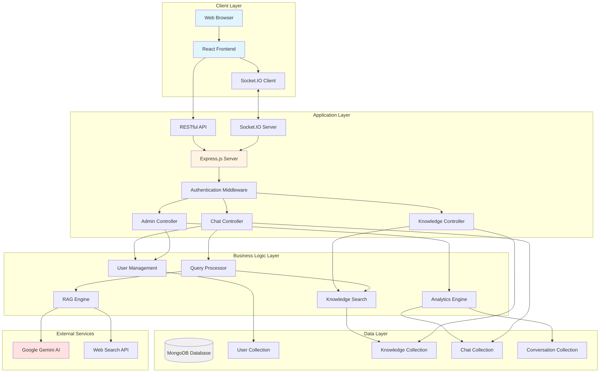
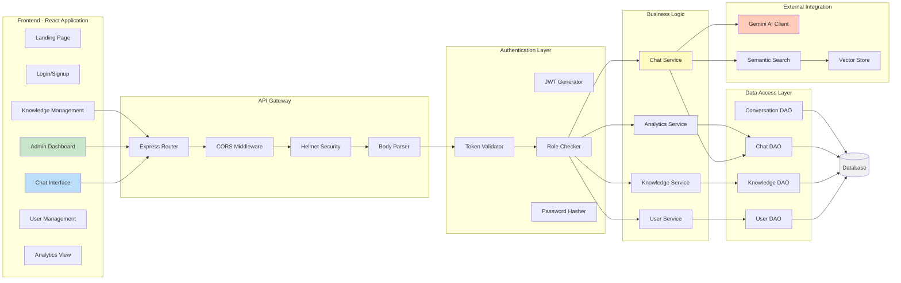
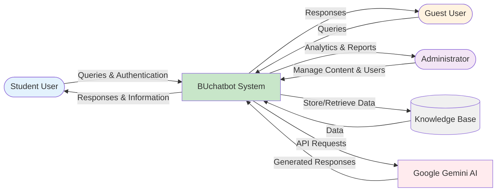
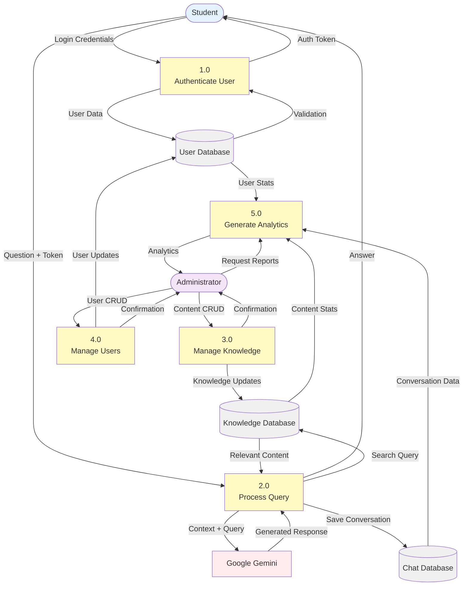
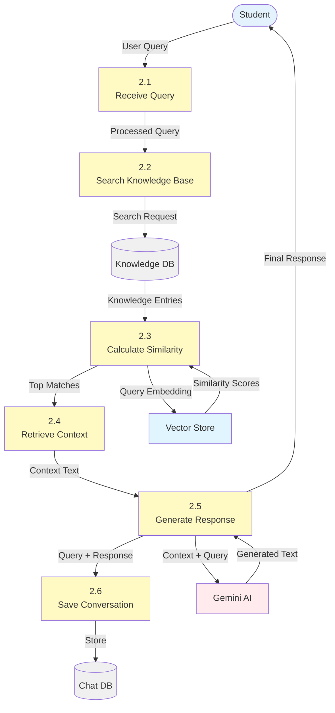
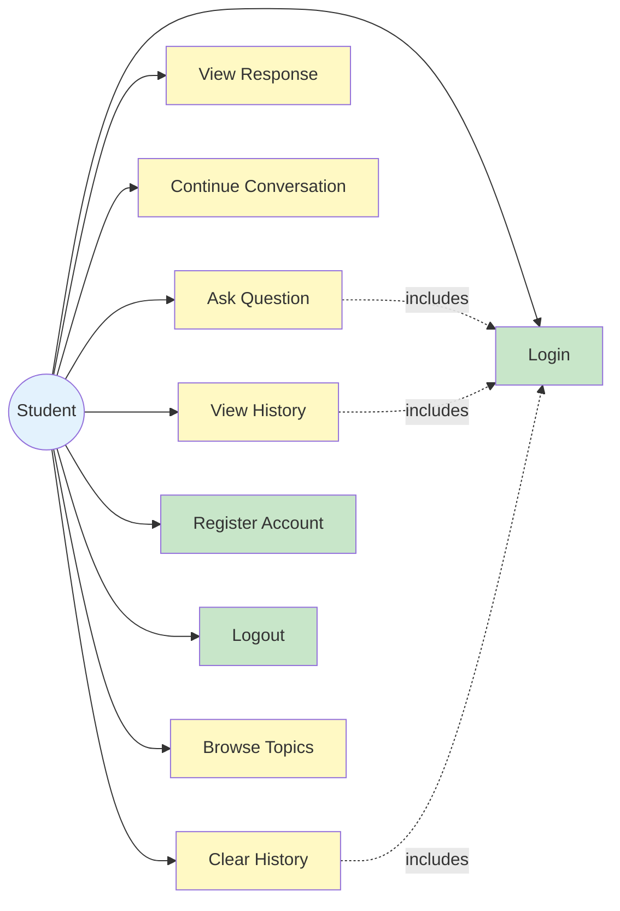
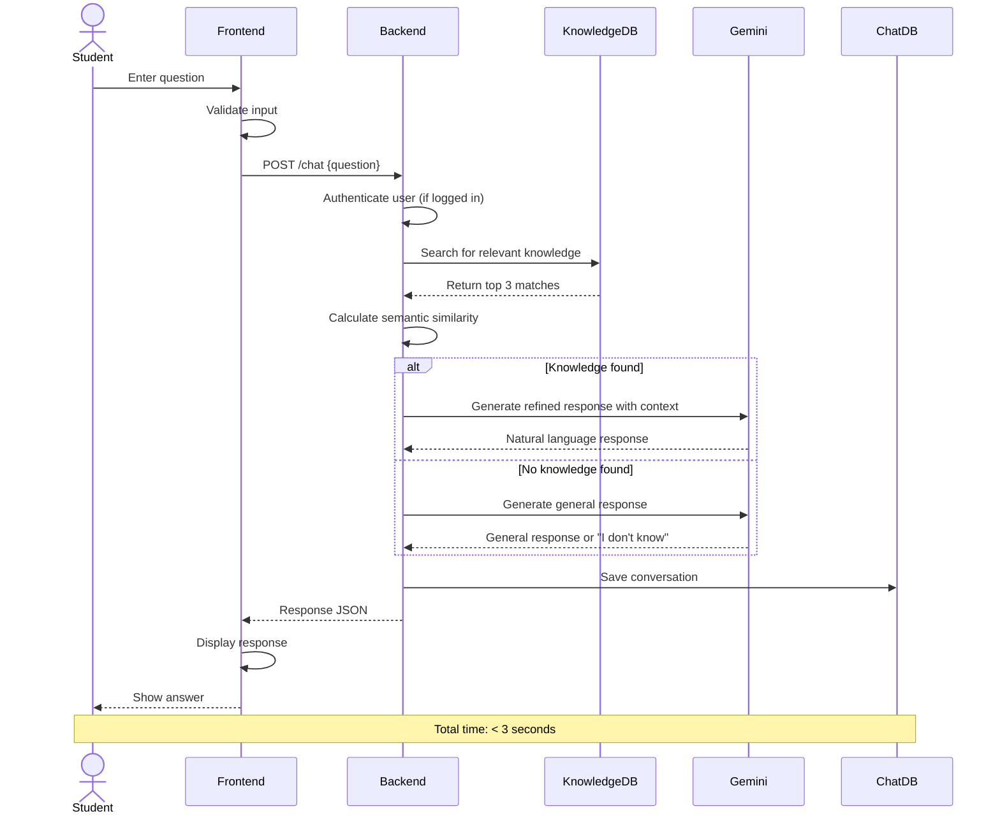
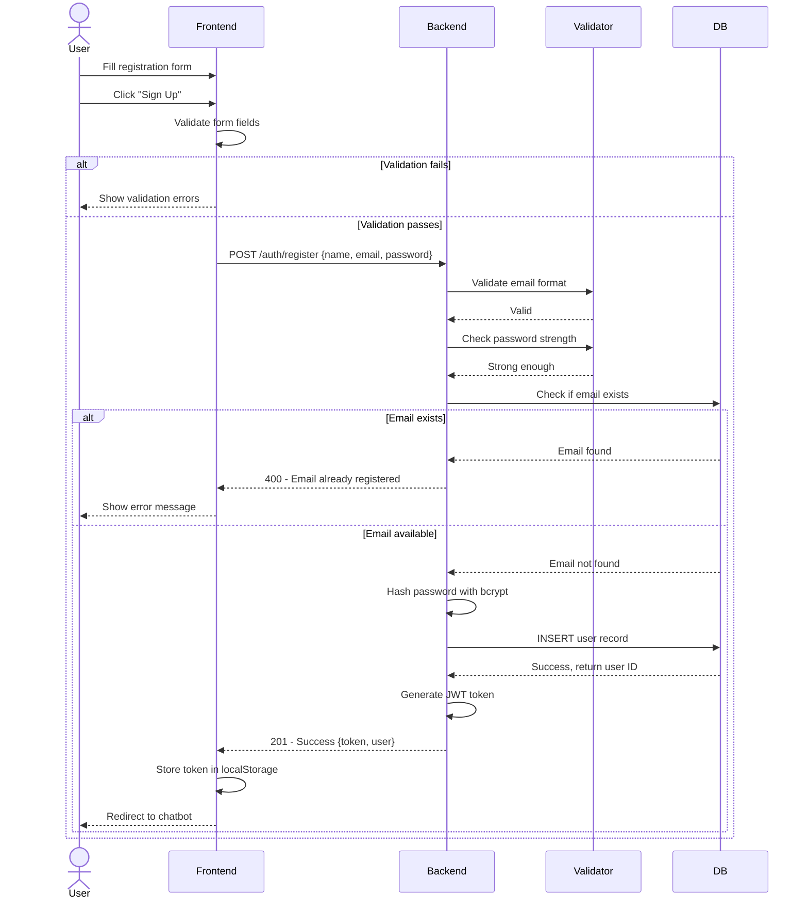

# CHAPTER 4: REQUIREMENTS, ANALYSIS & DESIGN

## 4.1 Introduction

This chapter presents a comprehensive description of the system requirements, analysis, and design for the BUchatbot system. It begins with user requirements gathered from stakeholders, followed by detailed functional and non-functional system requirements. The chapter then proceeds to system design, including architectural diagrams, data flow diagrams (DFDs), use case diagrams, sequence diagrams, and component diagrams. Database design is covered extensively, including the Entity Relationship Diagram (ERD), database schema, and table structures. Finally, interface design is presented through wireframes and mockups. All diagrams are provided in Mermaid format for easy reproduction and modification.

## 4.2 User Requirements

User requirements represent the needs and expectations of different stakeholders who will interact with the BUchatbot system. These requirements were gathered through interviews, surveys, observations, and analysis of existing systems.

### 4.2.1 Student User Requirements

Students represent the primary user group for BUchatbot. Their requirements include:

**Information Access Requirements:**
- Access information about academic programs, courses, and degree requirements
- Obtain details about admissions procedures and application processes
- Find information about fees, payment schedules, and financial aid
- Learn about campus facilities, locations, and services
- Get answers to questions about examination schedules and procedures
- Understand registration processes and deadlines
- Access information about student services (library, health, accommodation)

**Usability Requirements:**
- Easy-to-use interface requiring no technical expertise
- Quick access without lengthy registration processes
- Ability to ask questions in natural language
- Clear, concise responses without jargon
- Mobile-friendly interface for access on smartphones
- Fast response times (under 3 seconds)

**Functional Requirements:**
- Ability to ask follow-up questions in conversational manner
- Search and browse knowledge base topics
- Save conversation history for future reference
- Receive consistent and accurate information
- Get help or clarification when responses are unclear

**Accessibility Requirements:**
- Available 24/7 without time restrictions
- Accessible from any location with internet
- Work on various devices (desktop, tablet, smartphone)
- Minimal data usage for users with limited internet packages

### 4.2.2 Prospective Student/Guest User Requirements

Users who are not yet enrolled but seeking information about the university:

- Access basic university information without creating account
- Learn about admission requirements and application procedures
- Understand program offerings and specializations
- Get information about tuition fees and payment options
- Learn about campus life and facilities
- Find contact information for further inquiries
- Simple path to create account if desired

### 4.2.3 Administrator Requirements

University staff responsible for managing the chatbot system:

**Content Management Requirements:**
- Add, edit, and delete knowledge base entries
- Manage FAQ content
- Organize content by categories or topics
- Preview how content appears to users
- Version control or history of content changes

**User Management Requirements:**
- View registered users
- Manage user accounts (create, edit, delete)
- Assign or modify user roles (student, admin, etc.)
- Monitor user activity

**Analytics and Reporting Requirements:**
- View conversation statistics and metrics
- Identify most common questions and topics
- Monitor system performance metrics
- Generate reports on user satisfaction
- Identify knowledge gaps requiring new content
- Track query trends over time

**System Configuration Requirements:**
- Configure chatbot behavior and response modes
- Set system parameters and thresholds
- Manage integrations with external services
- Access system logs for troubleshooting

### 4.2.4 IT Staff Requirements

Technical personnel responsible for system maintenance:

- Clear system architecture documentation
- Access to system logs and error reports
- Monitoring dashboards for system health
- Backup and recovery procedures
- Security configuration options
- Performance optimization tools
- API documentation for integrations

### 4.2.5 University Administration Requirements

Senior administrators evaluating system effectiveness:

- Evidence of improved student satisfaction
- Metrics showing reduced administrative workload
- Cost-benefit analysis data
- Reports on system usage and adoption
- Insights into student concerns and needs
- Recommendations for institutional improvements based on chatbot data

## 4.3 System Requirements

System requirements translate user requirements into specific, testable, and implementable specifications. They are divided into functional requirements (what the system must do) and non-functional requirements (how the system must perform).

### 4.3.1 Functional Requirements

Functional requirements specify the behaviors, features, and capabilities that the system must provide.

#### FR1: User Authentication and Authorization

**FR1.1:** The system shall allow users to register with name, email, and password.

**FR1.2:** The system shall validate email format and password strength during registration.

**FR1.3:** The system shall hash passwords using bcrypt before storing in database.

**FR1.4:** The system shall allow users to log in with email and password.

**FR1.5:** The system shall generate and return JWT tokens upon successful authentication.

**FR1.6:** The system shall support role-based access control with roles including "user", "admin", "editor", and "viewer".

**FR1.7:** The system shall protect admin routes, requiring admin role for access.

**FR1.8:** The system shall allow users to request password recovery (future enhancement).

**FR1.9:** The system shall allow guest users to access basic chatbot functionality without authentication.

#### FR2: Conversational Interface

**FR2.1:** The system shall provide a web-based chat interface accessible through modern browsers.

**FR2.2:** The system shall accept user queries in natural language text.

**FR2.3:** The system shall display conversation history showing user questions and system responses.

**FR2.4:** The system shall distinguish visually between user messages and chatbot responses.

**FR2.5:** The system shall display typing indicators while processing queries.

**FR2.6:** The system shall support multi-turn conversations maintaining context.

**FR2.7:** The system shall allow users to clear conversation history.

**FR2.8:** The system shall persist conversation history for authenticated users.

#### FR3: Query Processing and Response Generation

**FR3.1:** The system shall process user queries using natural language processing.

**FR3.2:** The system shall search the knowledge base for relevant information using semantic similarity.

**FR3.3:** The system shall retrieve top 3 most relevant knowledge entries for each query.

**FR3.4:** The system shall integrate Google Gemini AI for natural language understanding and generation.

**FR3.5:** The system shall implement Retrieval-Augmented Generation (RAG) combining knowledge base retrieval with AI generation.

**FR3.6:** The system shall support multiple response modes:
- **kb-only**: Return knowledge base content directly
- **refine**: Use retrieved context with AI to generate polished responses
- **llm-only**: Always use AI generation without knowledge base constraints

**FR3.7:** The system shall default to "refine" mode unless configured otherwise.

**FR3.8:** The system shall handle errors gracefully when AI service is unavailable, falling back to knowledge base only.

**FR3.9:** The system shall respond to queries within 3 seconds under normal conditions.

**FR3.10:** The system shall provide informative error messages when unable to answer queries.

#### FR4: Knowledge Base Management

**FR4.1:** The system shall store knowledge base entries in MongoDB database.

**FR4.2:** The system shall support knowledge entries with fields: question, answer, tags, type, source, timestamps.

**FR4.3:** The system shall support two knowledge types: "knowledge" (articles) and "faq" (Q&A pairs).

**FR4.4:** The system shall provide admin interface for creating knowledge entries.

**FR4.5:** The system shall provide admin interface for editing existing knowledge entries.

**FR4.6:** The system shall provide admin interface for deleting knowledge entries.

**FR4.7:** The system shall validate knowledge entries ensuring required fields are present.

**FR4.8:** The system shall support searching and filtering knowledge entries in admin interface.

**FR4.9:** The system shall track creation and modification timestamps for all knowledge entries.

**FR4.10:** The system shall support importing knowledge from JSON files.

#### FR5: User Management (Admin)

**FR5.1:** The system shall provide admin interface to view all registered users.

**FR5.2:** The system shall allow admins to create new user accounts.

**FR5.3:** The system shall allow admins to edit user information (name, email, role).

**FR5.4:** The system shall allow admins to delete user accounts.

**FR5.5:** The system shall prevent admins from deleting their own accounts.

**FR5.6:** The system shall display user roles and registration dates.

**FR5.7:** The system shall support filtering users by role.

#### FR6: Conversation Management (Admin)

**FR6.1:** The system shall store all conversations from authenticated users.

**FR6.2:** The system shall allow admins to view list of all conversations.

**FR6.3:** The system shall display conversation metadata: user, message count, last message, date.

**FR6.4:** The system shall allow admins to view full conversation details.

**FR6.5:** The system shall allow admins to delete conversations.

**FR6.6:** The system shall mark conversations as "unread" when new messages arrive.

**FR6.7:** The system shall support real-time notification of new conversations to admins.

#### FR7: Analytics and Reporting

**FR7.1:** The system shall track and display total counts: users, conversations, knowledge articles, FAQs.

**FR7.2:** The system shall calculate and display average response time.

**FR7.3:** The system shall generate daily conversation volume charts for last 7 days.

**FR7.4:** The system shall display recent activity feed showing latest conversations.

**FR7.5:** The system shall track query patterns to identify common topics.

**FR7.6:** The system shall identify unanswered or poorly answered queries.

**FR7.7:** The system shall provide exportable reports (future enhancement).

#### FR8: Real-Time Communication

**FR8.1:** The system shall use Socket.IO for real-time client-server communication.

**FR8.2:** The system shall emit events when new conversations are created.

**FR8.3:** The system shall emit events when knowledge base is updated.

**FR8.4:** The system shall emit events when FAQs are modified.

**FR8.5:** The system shall update admin dashboards in real-time without page refresh.

**FR8.6:** The system shall support admin rooms for broadcasting admin-specific events.

### 4.3.2 Non-Functional Requirements

Non-functional requirements specify quality attributes and constraints on how the system operates.

#### NFR1: Performance

**NFR1.1:** The system shall respond to 95% of queries within 3 seconds under normal load.

**NFR1.2:** The system shall support at least 50 concurrent users without degradation.

**NFR1.3:** The system shall handle at least 1000 queries per hour.

**NFR1.4:** Knowledge base searches shall complete within 500 milliseconds.

**NFR1.5:** Page load times shall not exceed 2 seconds on 4G connection.

**NFR1.6:** The system shall have 99% uptime excluding planned maintenance.

#### NFR2: Scalability

**NFR2.1:** The system architecture shall support horizontal scaling of backend services.

**NFR2.2:** The database shall support growth to 10,000+ knowledge entries without performance degradation.

**NFR2.3:** The system shall handle increasing user base through load balancing (future).

**NFR2.4:** The system shall support caching mechanisms to improve performance at scale.

#### NFR3: Security

**NFR3.1:** The system shall encrypt passwords using bcrypt with minimum 10 salt rounds.

**NFR3.2:** The system shall use JWT tokens for authentication with appropriate expiration.

**NFR3.3:** The system shall validate and sanitize all user inputs to prevent injection attacks.

**NFR3.4:** The system shall implement CORS policies restricting access to authorized origins.

**NFR3.5:** The system shall use HTTPS for all communications in production.

**NFR3.6:** The system shall implement rate limiting to prevent abuse (future enhancement).

**NFR3.7:** The system shall log security-relevant events for audit purposes.

**NFR3.8:** The system shall not expose sensitive information in error messages.

**NFR3.9:** The system shall implement Helmet.js for security headers.

#### NFR4: Usability

**NFR4.1:** The system interface shall be intuitive, requiring no training for basic use.

**NFR4.2:** The system shall provide clear feedback for all user actions.

**NFR4.3:** The system shall display helpful error messages with recovery suggestions.

**NFR4.4:** The system shall follow consistent design patterns throughout.

**NFR4.5:** The system shall be accessible to users with basic computer literacy.

**NFR4.6:** The system shall provide contextual help where needed.

**NFR4.7:** Forms shall validate inputs and provide clear validation messages.

#### NFR5: Reliability

**NFR5.1:** The system shall handle errors gracefully without crashing.

**NFR5.2:** The system shall log errors for debugging and monitoring.

**NFR5.3:** The system shall implement retry mechanisms for transient failures.

**NFR5.4:** The system shall provide fallback responses when primary mechanisms fail.

**NFR5.5:** The system shall recover automatically from temporary service disruptions.

**NFR5.6:** Database operations shall be atomic to prevent data corruption.

#### NFR6: Maintainability

**NFR6.1:** Code shall follow consistent style guidelines and best practices.

**NFR6.2:** Code shall be well-documented with comments explaining complex logic.

**NFR6.3:** The system shall use modular architecture enabling independent component updates.

**NFR6.4:** The system shall use environment variables for configuration.

**NFR6.5:** The system shall include comprehensive API documentation.

**NFR6.6:** Database schema shall be versioned with migration scripts.

**NFR6.7:** The system shall support automated testing for regression prevention.

#### NFR7: Compatibility

**NFR7.1:** The system shall work on Chrome, Firefox, Safari, and Edge browsers (latest two versions).

**NFR7.2:** The system shall be responsive, adapting to screen sizes from 320px to 2560px.

**NFR7.3:** The system shall support modern mobile devices (iOS 13+, Android 9+).

**NFR7.4:** The system shall gracefully degrade on older browsers with appropriate messages.

**NFR7.5:** The system shall work on both Windows and macOS operating systems.

#### NFR8: Availability

**NFR8.1:** The system shall be available 24/7 excluding scheduled maintenance.

**NFR8.2:** Scheduled maintenance shall not exceed 2 hours per month.

**NFR8.3:** The system shall notify users of planned maintenance in advance.

**NFR8.4:** The system shall maintain backups enabling recovery within 1 hour.

#### NFR9: Portability

**NFR9.1:** The system shall be deployable on various hosting platforms (AWS, Azure, Heroku, VPS).

**NFR9.2:** The system shall use containerization-ready architecture (Docker-compatible).

**NFR9.3:** The system configuration shall be environment-agnostic using .env files.

**NFR9.4:** The system shall document deployment procedures for different environments.

#### NFR10: Compliance

**NFR10.1:** The system shall comply with university data privacy policies.

**NFR10.2:** The system shall collect only necessary user information.

**NFR10.3:** The system shall provide mechanisms for data export (future).

**NFR10.4:** The system shall allow users to delete their accounts and data (future).

## 4.4 System Design

System design translates requirements into technical specifications and visual models that guide implementation. This section presents the architectural design, data flow, use cases, and component interactions.

### 4.4.1 System Architecture

The BUchatbot system follows a **three-tier client-server architecture** with clear separation of concerns:

**Presentation Tier (Frontend):**
- React.js-based single-page application (SPA)
- Responsive user interface components
- State management using React hooks and context
- Client-side routing with React Router
- Real-time updates via Socket.IO client

**Application Tier (Backend):**
- Node.js runtime environment
- Express.js web application framework
- RESTful API endpoints
- Business logic and data processing
- Authentication and authorization middleware
- Integration with external AI services
- Real-time communication via Socket.IO server

**Data Tier (Database):**
- MongoDB NoSQL database
- Mongoose ODM for schema modeling
- Collections for users, knowledge, conversations, chats, FAQs

**External Services:**
- Google Gemini AI for NLP and response generation
- Potential web search API for extended information retrieval

#### High-Level Architecture Diagram (Mermaid)



#### Detailed System Architecture with Component Interaction



### 4.4.2 Data Flow Diagrams

Data Flow Diagrams (DFDs) show how data moves through the system, what processes transform it, and where it is stored.

#### Context-Level DFD (Level 0)

The context diagram shows the system as a single process with external entities.



#### Level 1 DFD - Main System Processes



#### Level 2 DFD - Query Processing Detail



### 4.4.3 Use Case Diagrams

Use case diagrams illustrate the functional requirements from the user's perspective, showing actors and their interactions with the system.

#### Student User Use Cases



#### Administrator Use Cases

```mermaid
graph TB
    Admin((Administrator))
    
    UC10[Manage Knowledge Base]
    UC11[Add Knowledge Entry]
    UC12[Edit Knowledge Entry]
    UC13[Delete Knowledge Entry]
    
    UC14[Manage FAQs]
    UC15[Add FAQ]
    UC16[Edit FAQ]
    UC17[Delete FAQ]
    
    UC18[Manage Users]
    UC19[View Users]
    UC20[Create User]
    UC21[Edit User]
    UC22[Delete User]
    
    UC23[View Conversations]
    UC24[View Conversation Detail]
    UC25[Delete Conversation]
    
    UC26[View Analytics]
    UC27[Generate Reports]
    
    UC28[Login as Admin]
    
    Admin --> UC10
    Admin --> UC14
    Admin --> UC18
    Admin --> UC23
    Admin --> UC26
    Admin --> UC28
    
    UC10 --> UC11
    UC10 --> UC12
    UC10 --> UC13
    
    UC14 --> UC15
    UC14 --> UC16
    UC14 --> UC17
    
    UC18 --> UC19
    UC18 --> UC20
    UC18 --> UC21
    UC18 --> UC22
    
    UC23 --> UC24
    UC23 --> UC25
    
    UC26 --> UC27
    
    UC10 -.->|requires| UC28
    UC14 -.->|requires| UC28
    UC18 -.->|requires| UC28
    UC23 -.->|requires| UC28
    UC26 -.->|requires| UC28
    
    style Admin fill:#f3e5f5
    style UC10 fill:#fff9c4
    style UC14 fill:#fff9c4
    style UC18 fill:#fff9c4
    style UC23 fill:#fff9c4
    style UC26 fill:#fff9c4
    style UC28 fill:#ffccbc
```



#### Detailed Use Case: Ask Question



### 4.4.4 Sequence Diagrams

Sequence diagrams show the order of interactions between objects over time for specific scenarios.

#### User Registration Sequence



#### User Login Sequence

```mermaid
sequenceDiagram
    actor User
    participant Frontend
    participant Backend
    participant DB
    participant JWT
    
    User->>Frontend: Enter email & password
    User->>Frontend: Click "Login"
    Frontend->>Backend: POST /auth/login {email, password}
    Backend->>DB: SELECT user WHERE email = ?
    
    alt User not found
        DB-->>Backend: NULL
        Backend-->>Frontend: 401 - Invalid credentials
        Frontend-->>User: Show error message
    else User found
        DB-->>Backend: User record with hashed password
        Backend->>Backend: Compare passwords using bcrypt
        
        alt Password incorrect
            Backend-->>Frontend: 401 - Invalid credentials
            Frontend-->>User: Show error message
        else Password correct
            Backend->>JWT: Generate token with user ID & role
            JWT-->>Backend: Signed JWT token
            Backend-->>Frontend: 200 - Success {token, user, role}
            Frontend->>Frontend: Store token & role in localStorage
            Frontend-->>User: Redirect based on role
            Note over Frontend,User: Admin -> Dashboard<br/>User -> Chatbot
        
